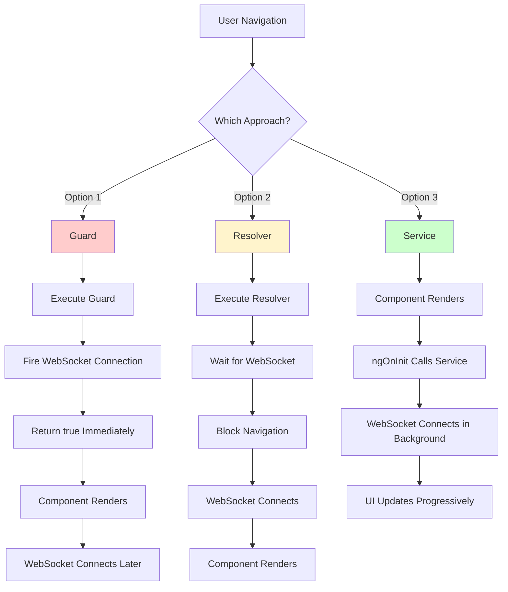
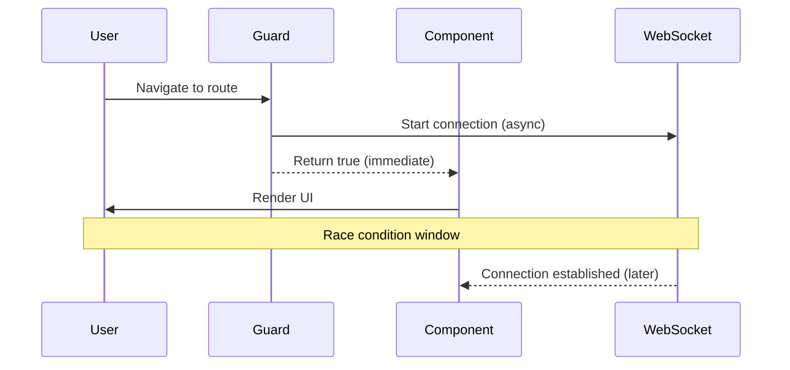
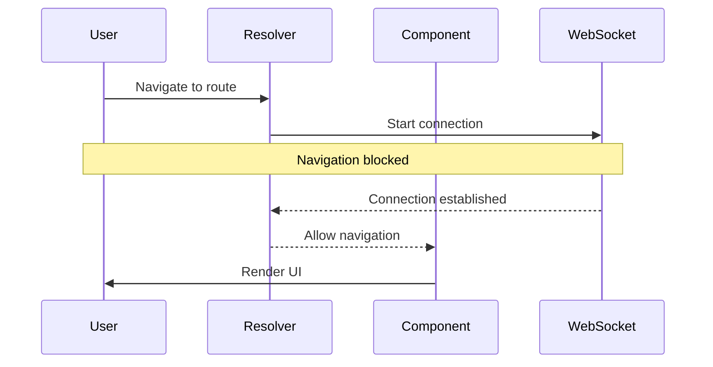
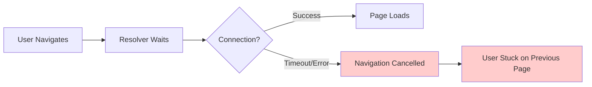
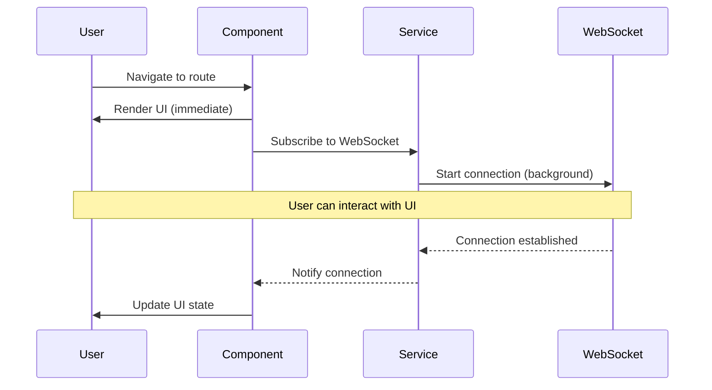
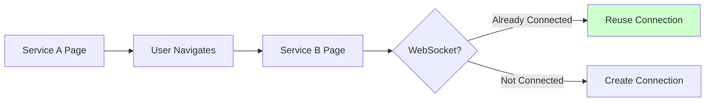

# 🧪 WebSocket Architecture Patterns in Angular

A comparative study of different approaches to initialize WebSocket connections in Angular applications, analyzing their impact on performance, user experience, and Core Web Vitals.

## 📋 Project Overview

This project demonstrates three different architectural patterns for WebSocket initialization in Angular:

1. **Guard Approach** - Using `CanActivate` guards
2. **Resolver Approach** - Using route resolvers
3. **Service Approach** - Using services with observables

Each implementation is fully functional and includes detailed logging to observe the behavior and timing of events.

## 🚀 Quick Start

```bash
# Install dependencies
npm install

# Start development server
npm start

# Open browser
http://localhost:4200
```

**Important:** Open your browser's developer console (F12) before testing to see detailed event logs and timing information.

## 📊 Architecture Overview



## 🔍 Approach 1: Guard Pattern

**Route:** `/socket_guard`

### Implementation

The guard triggers WebSocket connection but returns immediately, allowing navigation to proceed without waiting.

```typescript
export const websocketHandleGuard: CanActivateFn = (route, state) => {
  websocketService.connectWebsocketSync();
  return true; // Returns immediately
};
```

### Timeline



### Characteristics

**Timing:**
- Component render: ~50ms
- WebSocket connection: Variable (2-5 seconds)
- User sees content: Immediately

**Observations:**
- ✓ Fast initial render
- ✓ No navigation blocking
- ⚠️ WebSocket not guaranteed when component loads
- ⚠️ Potential race conditions
- ⚠️ UI may appear functional before it actually is

### Core Web Vitals Impact

| Metric | Value | Impact |
|--------|-------|--------|
| LCP | ~50ms | ✓ Excellent |
| FCP | ~50ms | ✓ Excellent |
| TBT | ~0ms | ✓ Excellent |
| Functionality | Delayed | ⚠️ Not immediate |

---

## 🔍 Approach 2: Resolver Pattern

**Route:** `/socket_resolver`

### Implementation

The resolver waits for WebSocket connection before allowing navigation to complete.

```typescript
export const webSockeHandleResolver: ResolveFn<boolean> = async (route, state) => {
  const result = await websocketService.connectWebsocketAsync();
  return result; // Blocks until complete
};
```

### Timeline



### Characteristics

**Timing:**
- WebSocket connection: 2-10 seconds (with timeout)
- Component render: After connection
- User sees content: After full connection

**Observations:**
- ✓ WebSocket guaranteed on component load
- ✓ Consistent state
- ⚠️ Blocks entire navigation
- ⚠️ User sees blank screen or spinner
- ⚠️ Failed connection prevents page access

### Core Web Vitals Impact

| Metric | Value | Impact |
|--------|-------|--------|
| LCP | +N seconds | ⚠️ Significantly degraded |
| FCP | +N seconds | ⚠️ Significantly degraded |
| TBT | +N seconds | ⚠️ Significantly degraded |
| Functionality | Guaranteed | ✓ Immediate when loaded |

### Failure Scenario



---

## 🔍 Approach 3: Service Pattern

**Routes:** `/socket_service_a` and `/socket_service_b`

### Implementation

Component renders immediately and subscribes to WebSocket connection in the background.

```typescript
ngOnInit() {
  // Component already rendered
  this.wsSubscription = this.websocketService
    .connectWebsocketNonBlocking()
    .subscribe(message => {
      // Update UI as events arrive
    });
}
```

### Timeline



### Characteristics

**Timing:**
- Component render: ~50ms
- WebSocket connection: Background (2-5 seconds)
- User sees content: Immediately
- Full functionality: After connection

**Observations:**
- ✓ Immediate render and interactivity
- ✓ Progressive enhancement
- ✓ Graceful error handling
- ✓ Singleton pattern (connection reuse between pages)
- ✓ Clear feedback during connection

### Progressive Enhancement

```typescript
// UI adapts to connection state
<button [disabled]="!wsConnected">
  {{ wsConnected ? 'Send Message' : 'Connecting...' }}
</button>
```

### Core Web Vitals Impact

| Metric | Value | Impact |
|--------|-------|--------|
| LCP | ~50ms | ✓ Excellent |
| FCP | ~50ms | ✓ Excellent |
| TBT | ~0ms | ✓ Excellent |
| Functionality | Progressive | ✓ Enhanced gradually |

### Singleton Pattern

When navigating from Service A to Service B, the WebSocket connection is reused:



---

## 📊 Comparative Analysis

### Performance Comparison

```mermaid
gantt
    title Navigation and Render Timeline
    dateFormat X
    axisFormat %L ms
    
    section Guard
    Navigate           :0, 1
    Component Render   :1, 50
    WebSocket Connect  :50, 2050
    
    section Resolver
    Navigate           :0, 1
    WebSocket Connect  :1, 2001
    Component Render   :2001, 2050
    
    section Service
    Navigate           :0, 1
    Component Render   :1, 50
    WebSocket Connect  :50, 2050
    UI Update          :2050, 2051
```



### Feature Comparison

| Feature | Guard | Resolver | Service |
|---------|-------|----------|---------|
| Initial Render Speed | Fast | Slow | Fast |
| WebSocket Guarantee | No | Yes | No |
| Navigation Blocking | No | Yes | No |
| Error Recovery | Limited | Blocks Page | Graceful |
| Progressive Enhancement | No | No | Yes |
| Connection Reuse | No | No | Yes |
| Memory Management | Manual | Manual | Automatic |
| User Feedback | Limited | Spinner | Rich |

### User Experience Timeline

**Guard Approach:**
```
0ms   ✓ See page
50ms  ⚠️ Try to interact (may fail)
2s    ✓ Fully functional
```

**Resolver Approach:**
```
0ms   ⏳ Waiting...
2s    ⏳ Still waiting...
2s    ✓ See page (fully functional)
```

**Service Approach:**
```
0ms   ✓ See page (with "connecting" state)
50ms  ✓ Can read content
2s    ✓ All features enabled
```

## 🧪 Testing Instructions

### 1. Test Guard Approach
1. Open browser console
2. Navigate to `/socket_guard`
3. Observe:
   - Immediate page render
   - Console logs showing connection timing
   - UI state before and after connection

### 2. Test Resolver Approach
1. Open browser console
2. Navigate to `/socket_resolver`
3. Observe:
   - Waiting period before page appears
   - Console logs showing blocked navigation
   - Guaranteed connection state on load

### 3. Test Service Approach
1. Open browser console
2. Navigate to `/socket_service_a`
3. Observe:
   - Immediate page render
   - Progressive UI updates
   - Connection state indicators
4. Navigate to `/socket_service_b`
5. Observe:
   - Connection reuse (singleton pattern)
   - No reconnection delay

### 4. Test Error Handling

To simulate connection failures, temporarily modify the WebSocket URL in `websocket.service.ts`:

```typescript
private readonly WS_URL = 'wss://invalid-server.example.com';
```

Observe how each approach handles the failure scenario.

## 🎯 Results and Conclusions

### Scenario Analysis

Each approach has distinct characteristics that make it suitable for different use cases:

**Guard Approach** provides fast rendering but lacks connection guarantees. The UI appears ready before functionality is available, which can create confusion.

**Resolver Approach** ensures the WebSocket is connected before showing the page, but significantly impacts load times and user experience. Failed connections prevent page access entirely.

**Service Approach** balances immediate rendering with progressive enhancement. Users can see and interact with the page while the connection establishes in the background, with clear feedback about the connection state.

### Performance Impact

Core Web Vitals measurements show that approaches that block rendering (Resolver) have the most significant negative impact on performance metrics. Non-blocking approaches (Guard and Service) maintain excellent LCP, FCP, and TBT scores.

### Recommended Approach

**Based on the observed results, the Service approach (Option 3) is recommended for WebSocket initialization** due to:

- Optimal Core Web Vitals scores
- Progressive enhancement capabilities
- Graceful error handling
- Connection reuse through singleton pattern
- Rich user feedback during connection
- Non-blocking user experience

The Service approach provides the best balance between performance, functionality, and user experience, making it suitable for production applications.

## 🏗️ Project Structure

```
src/app/
├── websocket.service.ts              # Service with three connection methods
│   ├── connectWebsocketSync()        # For Guard (non-blocking)
│   ├── connectWebsocketAsync()       # For Resolver (blocking)
│   └── connectWebsocketNonBlocking() # For Service (observable)
│
├── websocket-handle.guard.ts         # Guard implementation
├── web-socke-handle.resolver.ts      # Resolver implementation
│
├── page-with-guard/                  # Guard demo component
├── page-with-resolver/               # Resolver demo component
├── page-with-service-a/              # Service demo component A
└── page-with-service-b/              # Service demo component B
```

## 🔧 Technical Details

### WebSocket URL

The project uses a public demo WebSocket server:
```
wss://demo.piesocket.com/v3/channel_123?api_key=VCXCEuvhGcBDP7XhiJJUDvR1e1D3eiVjgZ9VRiaV&notify_self
```

### Angular Version

Built with Angular 19.2.17, using:
- Standalone components
- New control flow syntax (`@if`, `@for`)
- Signal-based reactivity where applicable

### Modern Angular Features

This project uses Angular's latest syntax and best practices:
- ✅ `@if` instead of `*ngIf`
- ✅ `@for` with track instead of `*ngFor`
- ✅ `[class]` expressions instead of `[class.name]`
- ✅ Standalone components (no NgModule)
- ✅ Specific imports (DatePipe, JsonPipe) instead of CommonModule
- ✅ `takeUntilDestroyed()` for automatic subscription cleanup (no manual unsubscribe)

### Automatic Memory Management

The Service approach uses Angular's `takeUntilDestroyed()` operator for automatic subscription management:

```typescript
ngOnInit() {
  this.websocketService.connectWebsocketNonBlocking()
    .pipe(takeUntilDestroyed())
    .subscribe({
      next: (message) => {
        // Handle messages
      }
    });
  // No need for manual unsubscribe in ngOnDestroy
}
```

This modern pattern:
- Automatically cleans up subscriptions when component is destroyed
- Prevents memory leaks without manual management
- Reduces boilerplate code
- Available since Angular 16+

## 📚 References

- [Angular Router Guards](https://angular.dev/guide/routing/common-router-tasks#preventing-unauthorized-access)
- [Angular Resolvers](https://angular.dev/api/router/Resolve)
- [Angular Services](https://angular.dev/guide/components/dependency-injection)
- [Core Web Vitals](https://web.dev/vitals/)
- [WebSocket API](https://developer.mozilla.org/en-US/docs/Web/API/WebSocket)

## 📄 License

MIT License - Feel free to use this project for learning and reference purposes.

---

**Note:** This is an educational project designed to demonstrate different architectural patterns and their trade-offs. The implementations intentionally highlight the characteristics of each approach for comparative analysis.
